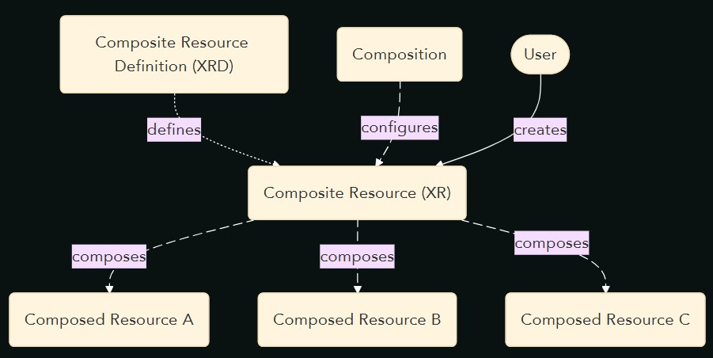

# Table of contents 📖
In this lab, we’ll cover the following Crossplane topics:
1. [Install and configure the AWS provider](../provider/)
1. [Create your first managed resource: an S3 bucket](../managed_resource/)
1. [Make your own composition with two EC2 instances](../composition/)
1. [Develop a custom function in Python](../function/)
1. [Generate resources with prompts using OpenAI](../IaP/)
---

# Compositions
## About
Compositions in v2 are a powerful way to modularize, abstract and dry code in Crossplane. You define a contract, which is an **XRD** `CustomResourceDefinition` and one o many implementations of this contract, the `Composition` that contains all the resources.  
Then, a user can create instances of this compositios, the XR `CustomResource`. This `CustomResource` will generate any resources defined in the `Composition`, from `ManagedResources` to Kubernetes native objects like `Deployment`, `Service`, etc.


## ClusterRole for composition
Crossplane has an RBAC manager controller to inyect privileges to most of the native resources, but for any kind of new resources for a new provider, you must create a ClusterRole with the apiGroups of this provider in order to let crossplane create those resources through compositions.  
Notice that, when you manually create managed resources, those resources are created by the user in the cluster, but in this case, those managed resources are generated by Crossplane through the composite resource.  
So, create the following `ClusterRole` object:
```yaml
apiVersion: rbac.authorization.k8s.io/v1
kind: ClusterRole
metadata:
  name: aws-upbound-managed-resources
  labels:
    rbac.crossplane.io/aggregate-to-crossplane: "true"
rules:
- apiGroups:
  - ec2.aws.upbound.io
  - elb.aws.upbound.io
  - s3.aws.upbound.io
  resources:
  - '*'
  verbs:
  - '*'
```

## Create a new XRD
Create the following `CustomResourceDefinition` object:
```yaml
apiVersion: apiextensions.crossplane.io/v2
kind: CompositeResourceDefinition
metadata:
  name: xbasicapps.example.com
spec:
  scope: Cluster
  group: example.com
  names:
    kind: XBasicApp
    plural: xbasicapps
  versions:
  - name: v1alpha1
    served: true
    referenceable: true
    schema:
      openAPIV3Schema:
        type: object
        properties:
          spec:
            type: object
            properties:
              instanceType:
                type: string
                default: t3.micro
              region:
                type: string
                default: us-east-1
            required: []
```
Notice the `scope` field, the posible values are `Cluster` or `Namespaced`:
* Cluster will let the composition create resources at cluster-wide level or inside namespaces.
* Namespace restrict the composition to create resources always inside a namespace.  
The `scope` is defined for **XRD** and **Composition** resources.  
The **XRD** and **Compositions** by themselves are always cluster-wide, the scope declares where the generated **resources** by them will live on.

## XRDs are CRDs
You can list now the **XRD** and the **CRD** that generated with:
```bash
$ kubectl get xrd
NAME                     ESTABLISHED   OFFERED   AGE
xbasicapps.example.com   True                    13s

$ kubectl get crd xbasicapps.example.com
NAME                     CREATED AT
xbasicapps.example.com   2025-10-22T08:32:23Z
```
So, you can also try to look for any **XR** of this type with:
```bash
$ kubectl get XBasicApps
No resources found
```

## Define a composition for the XRD
We are defining our composition `Cluster` scoped as AWS managed resources are cluster-wide. If we try to put cluster-wide resources inside a namespaced composition, it will fail.  
But first, we will install a commonly used function that is able to inyect information from the **XR** spec to the **Composition** to avoid hardcoding resource parameters and let the future **XR** override the ones defined in the **Composition**.  
```yaml
apiVersion: pkg.crossplane.io/v1
kind: Function
metadata:
  name: function-patch-and-transform
spec:
  package: xpkg.crossplane.io/crossplane-contrib/function-patch-and-transform:v0.8.2
```
Now, create the `Composition` object:
```yaml
apiVersion: apiextensions.crossplane.io/v1
kind: Composition
metadata:
  name: xbasicapp-aws
spec:
  compositeTypeRef:
    apiVersion: example.com/v1alpha1
    kind: XBasicApp
  mode: Pipeline
  pipeline:
    - step: create-ec2
      functionRef:
        name: function-patch-and-transform
      input:
        apiVersion: pt.fn.crossplane.io/v1beta1
        kind: Resources
        resources:
          - name: instance1
            base:
              apiVersion: ec2.aws.upbound.io/v1beta1
              kind: Instance
              spec:
                forProvider:
                  ami: ami-dummy
                  instanceType: t3.micro
                  region: us-east-1
                providerConfigRef:
                  name: default
            patches:
              - type: FromCompositeFieldPath
                fromFieldPath: spec.instanceType
                toFieldPath: spec.forProvider.instanceType
              - type: FromCompositeFieldPath
                fromFieldPath: spec.region
                toFieldPath: spec.forProvider.region
          - name: instance2
            base:
              apiVersion: ec2.aws.upbound.io/v1beta1
              kind: Instance
              spec:
                forProvider:
                  ami: ami-dummy
                  instanceType: t3.micro
                  region: us-east-1
                providerConfigRef:
                  name: default
            patches:
              - type: FromCompositeFieldPath
                fromFieldPath: spec.instanceType
                toFieldPath: spec.forProvider.instanceType
              - type: FromCompositeFieldPath
                fromFieldPath: spec.region
                toFieldPath: spec.forProvider.region
```
An **XRD** could have more than one `Composition` implementation, by adding the `compositeTypeRef` field, we are making this default for any **XR** using `XBasicApp`.  
Note that we are declaring the previously installed function `function-patch-and-transform` and using it in the `patches` field that is part of this function schema.  
In this case, we are defining only one step, but we can add as much as we need and they will get executed in the order that appears in the yaml.  
Now you can list the **composition** by:
```bash
$ kubectl get compositions
NAME            XR-KIND     XR-APIVERSION          AGE
xbasicapp-aws   XBasicApp   example.com/v1alpha1   7s
```

## Create the CustomResource
Now we are ready to create of first `CustomResource` (**XR**) and let this instansiate the managed resources.  
```yaml
apiVersion: example.com/v1alpha1
kind: XBasicApp
metadata:
  name: webapp-example1
spec:
  instanceType: t3.nano
  region: us-east-1
```
Now you can list it with:
```bash
$ kubectl get xbasicapps
NAME              SYNCED   READY   COMPOSITION     AGE
webapp-example1   True     True    xbasicapp-aws   89s

$ kubectl get managed
NAME                                                       READY   SYNCED   EXTERNAL-NAME         AGE
instance.ec2.aws.upbound.io/webapp-example1-a27deea38020   True    True     i-e0f763cc0585d6622   2m20s
instance.ec2.aws.upbound.io/webapp-example1-bfe050dfaeab   True    True     i-03a2908d566f4586f   2m20s
```
Review those instances with the aws cli:
```bash
$ awslocal ec2 describe-instances
```
Now delete the **XR** and see that the managed resources will be removed as well as the instances terminated in AWS:
```bash
$ kubectl delete xbasicapps webapp-example1
xbasicapp.example.com "webapp-example1" deleted

$ kubectl get managed
NAME                                                       READY   SYNCED   EXTERNAL-NAME         AGE
instance.ec2.aws.upbound.io/webapp-example1-a27deea38020   False   True     i-e0f763cc0585d6622   7m29s
instance.ec2.aws.upbound.io/webapp-example1-bfe050dfaeab   False   True     i-03a2908d566f4586f   7m29s

# After few seconds...

$ kubectl get managed
No resources found
```
And the cli:
```bash
$ awslocal ec2 describe-instances | jq -r '.Reservations[].Instances[] | "\(.InstanceId): \(.State.Name)"'

i-e0f763cc0585d6622: terminated
i-03a2908d566f4586f: terminated
```

Now you know how to create resources in crossplane without repeating code and you are ready for most of the crossplane projects.  
In the last chapter, we are going to create our own function, a way to inject our own logic in an imperative way using any programming language we want. For this lab, we will create it in Python.
